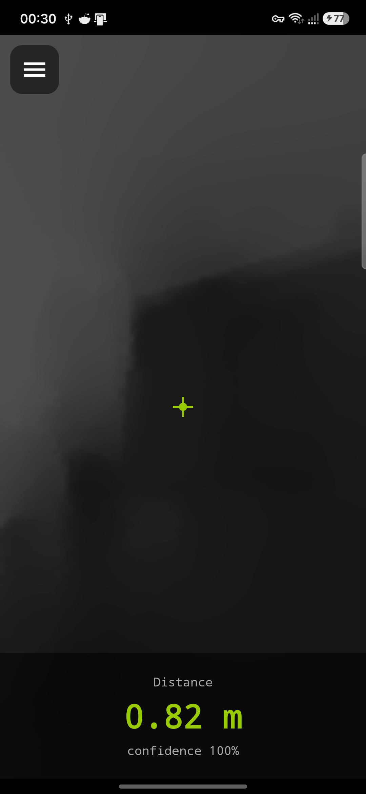
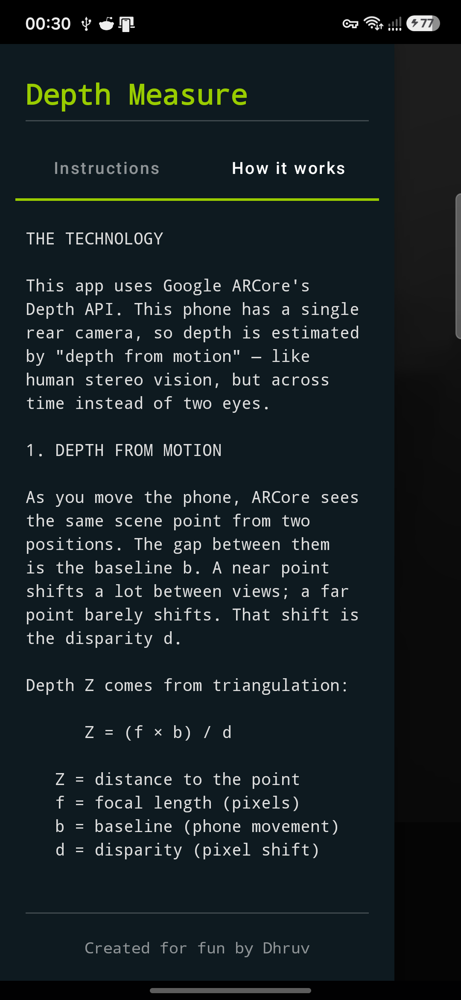

# Depth Measure

A tiny Android app that turns your phone's camera into a **live depth camera and tape measure**. Point it at something and it shows the distance in metres, plus a real‑time grayscale depth map of the scene — all powered by Google **ARCore's Depth API** on an ordinary single‑camera phone.

> Created for fun by **Dhruv**.

<p align="center">
  
  
</p>

---

## What it does

- **Live distance** to whatever is under the center crosshair.
- **Grayscale depth map** of the whole scene (near = dark, far = bright).
- **Confidence %** so you know how much to trust each reading.
- Helpful **"too close" / "too far" / "no surface"** hints when you're outside ARCore's range.
- A built‑in **side panel** with usage instructions and an explanation of the math behind it.

## Requirements

- An **ARCore‑supported** Android device ([list](https://developers.google.com/ar/devices)).
- **Android 7.0 (API 24)** or newer.
- **Google Play Services for AR** (the Play Store prompts to install it on first launch).

## Try it

**Option A — install the APK**
Download `app-debug.apk` from the [Releases](../../releases) page and install it on your phone
(enable "Install from unknown sources" if asked).

**Option B — build from source**

```bash
git clone https://github.com/dhruvkale17/DepthMeasure.git
cd DepthMeasure
```

Then either:

- **Android Studio** — open the folder, let Gradle sync, and hit ▶ Run, **or**
- **Command line** (with a device connected + USB debugging on):

  ```bash
  ./gradlew installDebug      # Windows: gradlew.bat installDebug
  ```

Build prerequisites: **JDK 17** and the **Android SDK** (platform 34, build‑tools 34).
Windows users: see [README_WINDOWS.md](README_WINDOWS.md) for a scripted, zero‑to‑running setup.

## How it works (short version)

Most phones have one rear camera, so depth is estimated by **depth from motion** — the same
idea as stereo vision, but across time instead of two eyes. As you move the phone, ARCore sees
each scene point from two positions (baseline `b`) and measures how far it shifts between them
(disparity `d`). Depth follows from triangulation:

```
Z = (f × b) / d
```

where `f` is the focal length in pixels. ARCore returns a 16‑bit depth image (13 bits of
millimetres → an 8.19 m max range, 3 bits of confidence), which the app decodes and renders on
the GPU. The full explanation, including the pinhole camera model, lives in the app's
**"How it works"** panel.

## Project structure

```
DepthMeasure/
├─ app/
│  └─ src/main/
│     ├─ java/com/example/depthmeasure/
│     │  ├─ MainActivity.java          # AR session, UI, measurement logging
│     │  ├─ DepthRenderer.java         # OpenGL ES depth decode + grayscale render
│     │  ├─ DisplayRotationHelper.java # display/sensor rotation handling
│     │  └─ DepthMeasurement.java       # single depth sample (value object)
│     └─ res/                           # layouts, drawables, strings, theme
├─ gradle/wrapper/                      # Gradle wrapper
├─ README_WINDOWS.md                    # Windows dev setup + build helper scripts
└─ build.gradle, settings.gradle, ...
```

## Tech

Java · ARCore 1.42 (Depth API) · OpenGL ES 3.0 · AndroidX · min SDK 24 / target SDK 34.

## License

[MIT](LICENSE) © 2026 Dhruv
